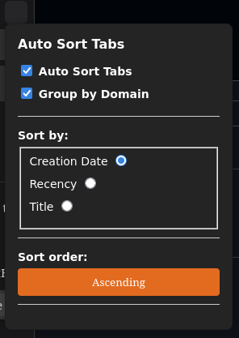

# Auto Sort Tabs 

A Firefox Extension that automatically sorts tabs to preferences.

## Installation

1. **Simply available in the Firefox Add-on Store:**
	https://addons.mozilla.org/en-US/firefox/addon/auto-sort_tabs/
	
2. **As a temporary Add-on:**
	1. Clone this repository.
	2. Open Firefox and navigate to `about:debugging`.
	3. Click **"This Firefox"** > **"Load Temporary Add-on"**.
	4. Select the `manifest.json` file from this project folder.